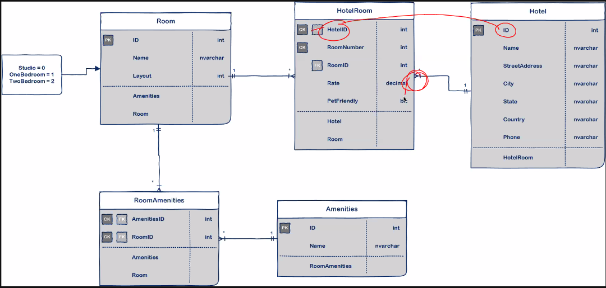
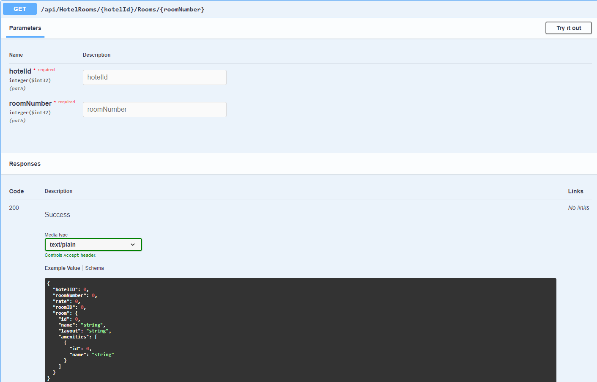

# Asynch-Inn

**Author**: Matthew Petersen
**Version**: 1.0.0 

## Overview
This program is an exercise with the ASP.NET Core framework, demonstrated by the use of a database using hotels. Below you can view the ERD and images of how the data comes in. Each hotel is linked to a set of hotel rooms. The hotel rooms are related to a room(base) which has a series of enumerated layouts. Each base room is also related to amenities, which is further related to a set of all amenities!

This program uses a dependency injection implementation. Each controller directs it's own CRUD operations for each class. DTOs are implemented to transfer data between itself and the UI layer. This reduces the amount of data that is needed to be sent across the wire.

## Getting Started
Clone the repository down to your local machine with: Git clone clonedRepoHere

Next, select File -> Open -> Project/Solution

Find the cloned repository, and double click to open it. -> AsyncInnServ

Lastly, select and open the AsyncInnServ.sln

You can now run the program with the green start button!

## Example

## Architecture
C# + .NET

## Deployed App via Azure
https://asynchinnserv20210202154614.azurewebsites.net/

## Change Log
01/26/2021 - initial upload of the lab! Stay tuned for more.
01/27/2021 - Dependency Injection succsessful.
01/28/2021 - Added more classes, re-wired controllers+repositories.
2/1/2021 - DTO's implemented.
2/2/2021 - Azure deployment, Swagger and testing!
